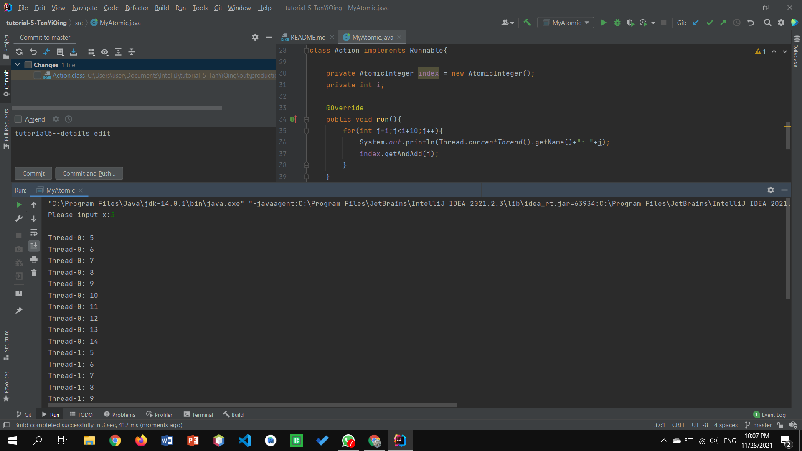
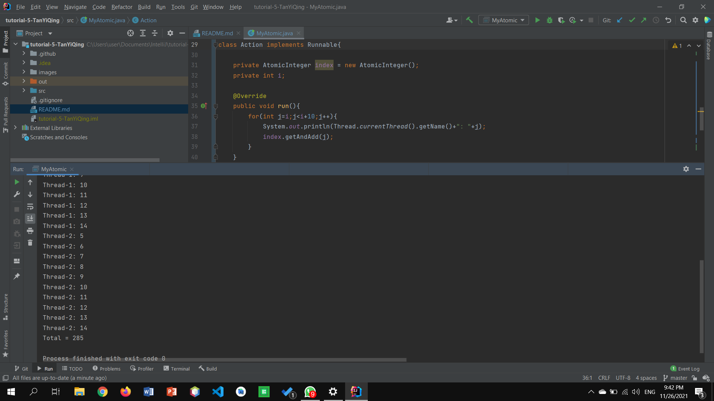

## Your Info:
1. Matric Number: 270607
1. Name: Tan Yi Qing

## Instruction:

1. Study the code below:

   https://github.com/zhamri/STIW3054-RT-Programming/blob/master/src/Week_05/TestAtomicInteger1s.java
   https://docs.oracle.com/javase/tutorial/displayCode.html?code=https://docs.oracle.com/javase/tutorial/essential/concurrency/examples/AtomicCounter.java
   

1. Then write a Java program to start __THREE (3)__ threads where all the threads will display 10 number starting from x incremented by 1, using `java.util.concurrent.atomic.AtomicInteger` class
   
1. Then display the total numbers for all the threads. 

1. x is integer number and MUST be input from the keyboard.

1. The program file which has the main method should be named `MyAtomic.java` and place in the `src` folder.

1. Screenshot the result and upload to this repo too.

1. Watch the video to clone, add, commit and push a repository to GitHub: https://youtu.be/RXV3Yusr0SI

## Example of the output
```
Please input x: 5

Thread-0: 5
Thread-0: 6
Thread-0: 7
...
...
Thread-0: 14
Thread-1: 5
Thread-1: 6
Thread-1: 7
...
...
Thread-1: 14
Thread-2: 5
Thread-2: 6
Thread-2: 7
...
...
Thread-2: 14
Total = 285
```

## Your Output/Result


